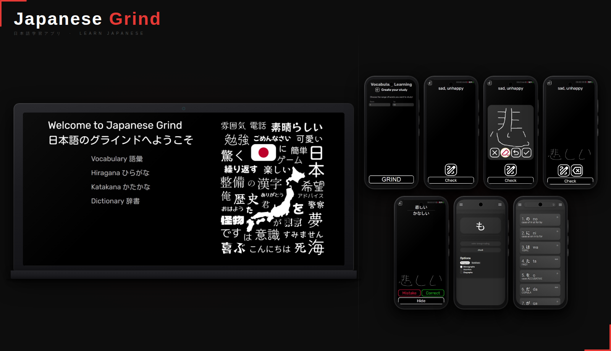

# Japanese Grind

## About

Japanese Grind is a web application designed to help users learn Japanese through flashcard-based training.

This project is part of a larger Japanese learning ecosystem that consists of two separate but connected applications.

Originally, the project started as **JapanEasy**, a Vite-based application focused on learning Japanese writing systems and dictionary functionality.

During development, I decided to migrate to **Next.js** to build a more scalable and structured frontend. This led to the creation of a new project called **Japanese Grind**, which became the main application for vocabulary learning and the central user experience.

Instead of rewriting everything from scratch, I kept the original **JapanEasy (Vite)** project as a separate repository because it was already stable, functional, and well-optimized.

As a result, both applications now work together as one ecosystem.

---

## Project Structure

The system is split into two repositories that form a complete Japanese learning platform:

### Japanese Grind (this repository)

👉 https://japanese-grind.vercel.app

Built with **Next.js**, this application focuses on:

- Main menu and navigation
- Flashcards for learning the 5000 most frequent Japanese words

---

### JapanEasy (Vite application)

👉 https://github.com/ErNeRooo/JapanEasy  
👉 https://nihon-go-kaizen.web.app

Built with **Vite**, this application focuses on:

- Hiragana learning
- Katakana learning
- Japanese dictionary functionality

---

## Tech Stack

### Japanese Grind

- Next.js
- React
- TypeScript
- Sass

### JapanEasy

- React
- Vite
- TypeScript
- Sass
